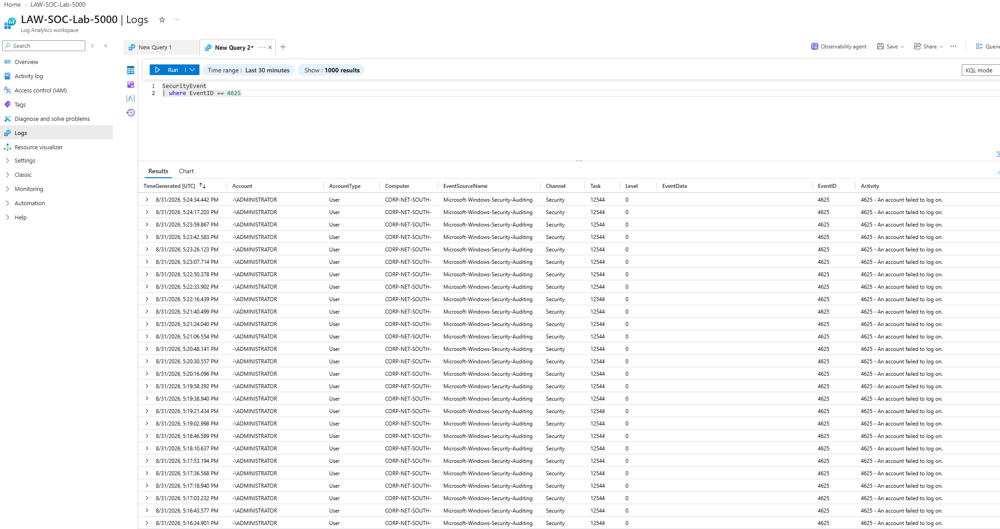
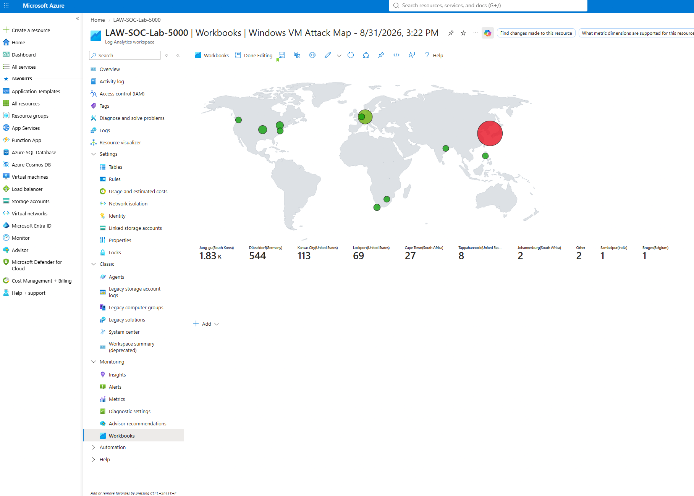

# Cyber Home Lab: Microsoft Sentinel SOC Project (2026)
Cloud SOC + Threat Detection Lab | Azure + Sentinel

## 📌 Overview
This project is a complete, cloud-based **Security Operations Center (SOC) lab** built using **Microsoft Azure** and **Microsoft Sentinel**.  
The goal was to deploy a Windows virtual machine, expose it to the internet as a honeypot, ingest real attacker traffic, and analyze global brute-force attempts using Sentinel’s SIEM capabilities.

This lab demonstrates hands-on experience with:
- Cloud security architecture  
- SIEM operations  
- KQL querying  
- Threat detection  
- Log enrichment  
- Dashboard and workbook creation
  

## 🎯 Objectives
- Deploy a public-facing VM to attract real-world brute-force attacks  
- Centralize logs using Azure Log Analytics Workspace  
- Integrate Microsoft Sentinel for SIEM analysis  
- Query attacker activity using Kusto Query Language (KQL)  
- Enrich logs with geolocation data  
- Build a real-time attack map showing global threat activity  
- Demonstrate SOC workflows such as monitoring, triage, and incident creation
  

## 🏗️ Architecture
Azure VM (Windows) → Log Analytics Workspace → Microsoft Sentinel → Workbooks & Dashboards

**Components Used**
- **Azure Virtual Machine (Windows)** – Honeypot receiving global RDP brute-force/password spraying attempts  
- **Log Analytics Workspace** – Central log ingestion  
- **Microsoft Sentinel** – SIEM for analysis, dashboards, and incident workflows  
- **KQL** – Querying failed logins, attacker IPs, and event patterns  
- **Geolocation Enrichment** – CSV-based IP-to-location mapping  
- **Attack Map Workbook** – Real-time visualization of global attacker activity  

## 🔧 Process Summary
1. Created a free Azure subscription  
2. Deployed a Windows VM and opened RDP to the internet  
3. Verified attacker activity through raw logs on the VM  
4. Built a Log Analytics Workspace and connected the VM  
5. Queried logs with KQL to extract failed login attempts and attacker IPs  
6. Uploaded geolocation data to enrich SIEM logs  
7. Built a Sentinel attack map to visualize global brute-force attempts  
8. Explored incident creation and SOC-style triage workflows
   

## 📊 Key Results
- Captured thousands of real-world brute-force login attempts  
- Identified attacker origins using geolocation enrichment  
- Built dashboards showing global threat patterns  
- Demonstrated hands-on SIEM operations and cloud security fundamentals  
- Created a portfolio-ready SOC project aligned with entry-level cybersecurity roles
  

## 🧠 Skills Demonstrated
- Cloud Security (Azure)  
- SIEM Operations (Microsoft Sentinel)  
- Threat Detection & Log Analysis  
- KQL Querying  
- Dashboard & Workbook Development  
- Incident Response Fundamentals
  

## 📁 Repository Structure
/Security-Operations-Center-Home-Lab
│ README.md
│ images/
│ ├── azure-log-query.png
│ └── attack-map.png
│ kql-queries/        ← (optional future folder)
│ geolocation-data/   ← (optional future folder)
│ notes/              ← (optional future folder)
> This structure organizes all artifacts used in the SOC lab, including screenshots, queries, enrichment data, and documentation.

## 📸 Screenshots 
### 1. Log Analytics Query Results- Shows KQL query output from Azure Log Analytics workspace (`LAW‑SOC‑Lab‑5000`), filtering failed login attempts and enriching with geolocation data.

### 2. Windows VM Attack Map- Displays global attack visualization from Microsoft Sentinel workbook, highlighting top sources (South Korea, Germany, U.S., South Africa, India, Belgium).

## 🔗 Future Enhancements
- Add automated alert rules  
- Integrate Azure Defender  
- Build custom detection rules  
- Add incident automation with Logic Apps
  

## 🙌 Acknowledgments
Inspired by hands-on SOC workflows and cloud security best practices.
